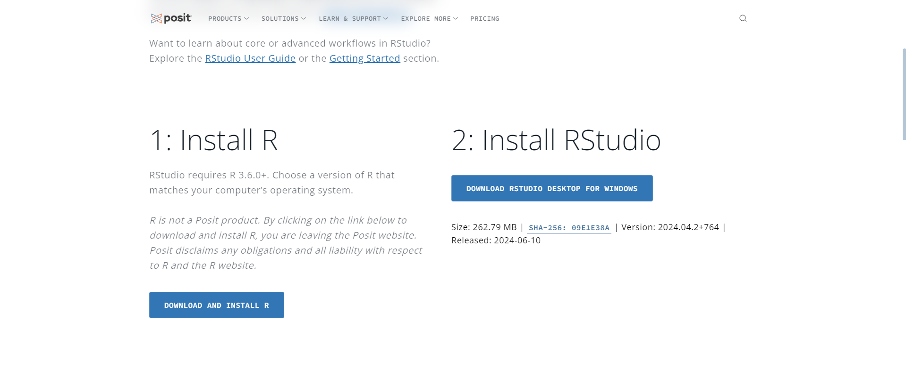
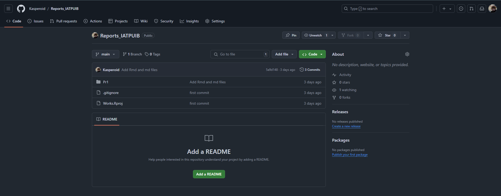
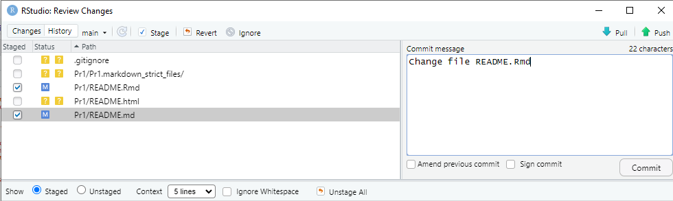
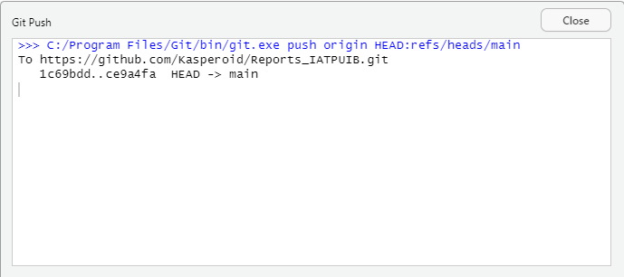

---
format:
  md:
    output-file: "README.md"
editor: "visual"
---

```{r setup, include=FALSE}
knitr::opts_chunk$set(echo = TRUE)
```

# Практическая работа 0

Подготовка воспроизводимых отчетов

## Цель

1.  Подготовить рабочее окружение для работы с Rstudio

2.  Разработать отчет с использованием стека технологий Rmarkdown и Quarto

3.  Оформить отчет в соответствии с шаблоном

4.  Создать репозиторий на GitHub и запушить проект

## Исходные данные

1.  Ноутбук

2.  OC Windows

3.  Rstudio

4.  Github

## Варианты решения задачи

Для создания воиспроизводимых отчетов можно использовать использовать md, rmd или quarto файлы, все варианты дают достаточный функционал для составления отчетов по выполнению заданий, в данной ЛР будет использоваться rmd.

## Общий план выполнения

1.  Скачать и установить на ПК R и Rstudio

2.  Создать репозиторий на GitHub

3.  Оформить отчёт

## Содержание ЛР

### Шаг 1

**На данном шаге производится настройка рабочего окружения.**

Для этого необходимо скачать R и RStudio Desktop




Далее происходит установка данного ПО


### Шаг 2

**На данном шаге происходит создание репозитория на gitHub и загрузка изменений**

На сайте gitHub был создан репозиторий, для хранения практических работ



После этого происходит сохранение изменений (commit) и отправка изменений в удаленный репозиторий (push)





## Оценка результатов

1.  Была подготовлена и настроена для работы среда RStudio

2.  Удалось познакомиться с методом составления отчета с помощью Rmarkdown

3.  Была произведена работа с языком R, знакомство с основами данного языка и особенностями

4.  Работа успешно загружена в репозиторий GitHub

## Вывод

По итогу данной работы были изучены основы языка R с помощью учебных заданий swirl
