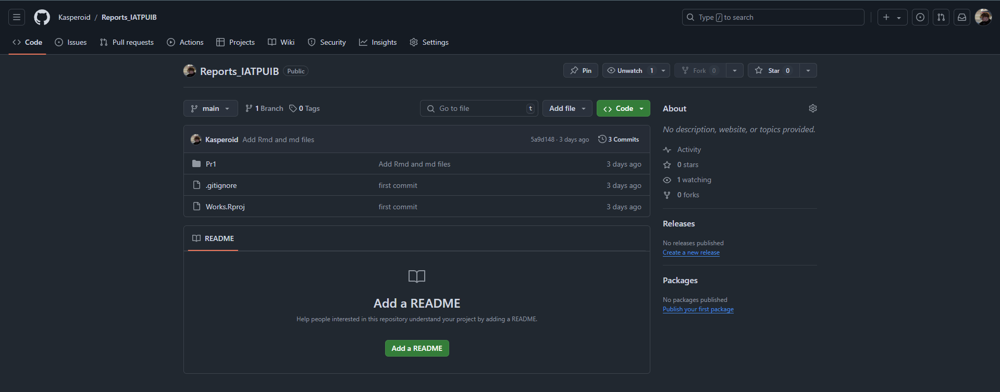
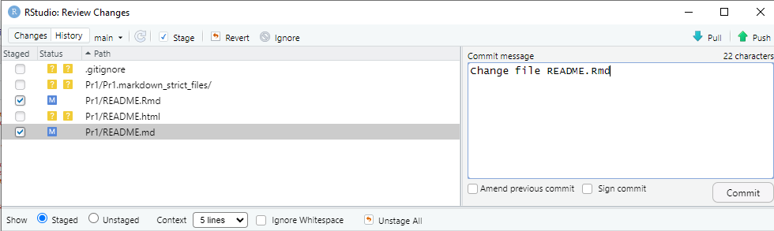
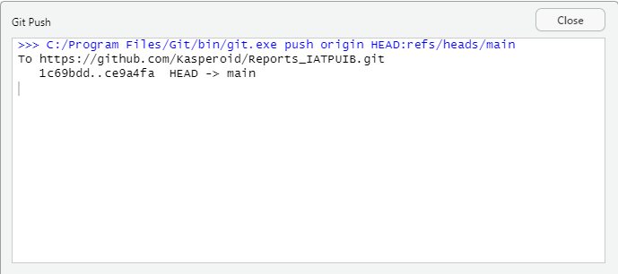

# Практика № 1

Введение в R

## Цель работы

1.  Подготовить рабочее окружение для работы с Rstudio

2.  Разработать отчет с использованием стека технологий Rmarkdown и
    Quarto

3.  Оформить отчет в соответствии с шаблоном

4.  Познакомиться с языком R

5.  Пройти обучающие уроки в swirl

6.  Создать репозиторий на GitHub и запушить проект

## Исходные данные

1.  Ноутбук

2.  OC Windows

3.  Rstudio

4.  Библиотека swirl

5.  Github

## План выполнения работы

1.  Скачать и установить на ПК R и Rstudio

2.  Установить пакет swirl

3.  Выполнить ознакомительные задания

4.  Создать репозиторий на GitHub

5.  Оформить отчёт

## Содержание практической работы

### Шаг 1

**На данном шаге производится настройка рабочего окружения.**

Для этого необходимо скачать R и RStudio Desktop

<figure>

<figcaption aria-hidden="true"><em>Скачивание R</em></figcaption>
</figure>

<figure>

<figcaption aria-hidden="true"><em>Скачивание RStudio</em></figcaption>
</figure>

Далее происходит установка данного ПО

<figure>

<figcaption aria-hidden="true"><em>Установка R</em></figcaption>
</figure>

<figure>

<figcaption aria-hidden="true"><em>Установка RS</em></figcaption>
</figure>

### Шаг 2

**На данном шаге происходит установка пакета swirl**

Для установки пакета swirl воспользуюсь функцией R
`install.packages("swirl")`

<figure>

<figcaption aria-hidden="true"><em>Установка пакета
swirl</em></figcaption>
</figure>

### Шаг 3

**На данном шаге происходит запуск заданий и их выполнение**

Для запуска swirl воспользуюсь функцией `swirl::swirl()`

После запуска необходимо пройти небольшую регистрацию и скачать
необходимый пакет курсов (в данном случае *R Programming: The basics of
programming in R*)

<figure>

<figcaption aria-hidden="true"><em>Регистрация и установка
пакета</em></figcaption>
</figure>

После скачивания пакета заданий, просиходит выбор необходимых заданий

<figure>

<figcaption aria-hidden="true"><em>Выбор первого
задания</em></figcaption>
</figure>

#### Первое задание (Basic Building Blocks)

По итогу прохождения данного задания я понял:

1.  Чтобы сохранить некоторое значения в переменную, необходимо
    воспользоваться специальным символом `<-`, например, `x <- 5 + 7`,
    данная запись обозначает, что в переменную с названием `x`,
    запишется результат выражения `5 + 7`

2.  Для просмотра додержимого той или иной переменной необходимо просто
    ввести ее наименование

3.  Так же можно присваивать переменным значения, которые получаются с
    использованием других переменных, например, `y <- x - 3`, где
    `x = 12`, поэтому в итоге в переменной `y` содержится значение 9

4.  В языке R существует основное понятие - вектор, любая переменная
    содержит вектор значений, даже переменная `x`, которая равна 12, это
    вектор, с длинной 1. Для создания вектора, можно воспользоваться
    функцией `c(...some_arg)`, например, присвою переменной `z` вектор
    значений `1.1, 9, 3.14`, то есть `z <- c(1.1, 9, 3.14)`, в итоге в
    переменной будет хранится вектор с длинной 3.

5.  Для того, чтобы узнать что делает та или иная функция, необходимо
    перед ней поставить знак `?`, например, `?c`

6.  Можно, так же, складывать вектора, например, имеется переменная z,
    которая содержит вектор 1.10 9.00 3.14, и необходимо создать новый
    вектор и добавить в него новое значение, допустим, 5, таким образом,
    чтобы это проделать необходимо прописать следующую команду `c(z, 5)`

7.  К векторам можно применять различные арифметические выражения (+ - /
    \* ^, `abs()`, `sqrt()` ), например, дан тот же вектор z и имеется
    выражение `z * 2`, по итогу получится новый вектор, каждое значение
    которого будет умножено на 2

8.  При использовании арфиметических выражений между двумя векторами
    стоит учитывать их длину, если два вектора имеют одинаковую длину,
    то происходит по-элементное выполнение той или иной операции,
    например, имеется вектор `z = (1, 2)` и `x = (3, 4)`, пусть данные
    векторы складываются `z + x`, по итогу получится вектор `(4, 6)`.
    Если вектора имеют разную длину, то происходит зацикливание
    наименьшего, например, имеется вектор `z = (1, 2, 3, 4)` и
    `x = (5, 6)` данные векторы складываются, по итогу получается вектор
    `(6, 8, 8, 10)`

#### Второе задание (Workspace and Files)

По итогу прохождения данного задания я понял, что имеется набор команд,
которые позволяют создавать новые директории и файлы, просматривать пути
до них, копировать и переименовывать файлы

#### Третье задание (Sequences of Numbers)

В результате прохождения данного урока я понял, что:

1.  Создание последовательности чисел с помощью `:`, можно создавать
    последовательности как из целочисленных значений (`1:20`, от 1 до
    20), так и из дробных (`pi:10`, от 3.14 до 9.14). Так же можно
    создавать последовательности чисел по убыванию, например `15:1`, в
    итоге получится последовательность от 15 до 1

2.  Помимо использования `:` при создании последовательности можно
    использовать функцию `seq(a, b, c)`, где a и b - начало и конец
    интервала соответственно, c - (by - шаг, length - длинна).

3.  Есть еще одна функция для создания последовательности чисел,
    `rep()`. Данная функция принимает символы и число повторений, то
    есть, например, `rep(0, times=40)` результатом будет строка из 40
    нулей. Так же из интересного можно повторять не только вектор или
    символ, но и каждый символ вектора, просто вместо второго аргумента
    можно передать `each = ...`, например, `rep(c(0, 1, 2), each=10)`,
    по итогу будет строка состоящая из подряд идущих 10 нулей, единиц и
    двоек

#### Четвертое задание (Vectors)

По итогу прохождения данного урока можно сделать следующие выводы:

1.  Векторы могут хранить разные значения, в том числе и логические
    (`TRUE`, `FALSE`). При использовании логических операторов
    (`> <= == !=`) с векторами происходит поэлементное применение того
    или иного логического выражения, по итогу получается вектор из
    булевых значений.

2.  Так же в языке R можно использовать логические ИЛИ (`|`), И (`&`).

3.  Из символьного вектора можно получить строку, используя команду
    `paste(вектор, collapse = разделитель|sep = разделитель)`.

#### Пятое задание (Missing Values)

1.  В R существует специальное значение: `NA` - пропущенное или
    некоторое содержимое, которое не имеет значения. К NA не применяются
    арифметические выражения.

2.  Функция `is.na()` показывает наличие NA в векторе (Но сравнить с NA
    нельзя, так как NA это неизвестное значение, то невозможно провести
    сравнение со значениями вектора)

3.  В R булевым значения приравниваются численные, то есть `True = 1`,
    `False = 0`

4.  Имеется еще ряд специальных значений: `NAN` - не число, получается
    путём деления 0 на 0 и `Inf`

### Шаг 4

**На данном шаге происходит создание репозитория на gitHub и загрузка
изменений**

На сайте gitHub был создан репозиторий, для хранения практических работ

<figure>

<figcaption aria-hidden="true"><em>Создание репозитория на
GitHub</em></figcaption>
</figure>

После этого происходит сохранение изменений (commit) и отправка
изменений в удаленный репозиторий (push)

<figure>

<figcaption aria-hidden="true"><em>Сохранение
изменений</em></figcaption>
</figure>

<figure>

<figcaption aria-hidden="true"><em>Отправка изменений</em></figcaption>
</figure>

## Оценка результатов

1.  Была подготовлена и настроена для работы среда RStudio

2.  Удалось познакомиться с методом составления отчета с помощью
    Rmarkdown

3.  Была произведена работа с языком R, знакомство с основами данного
    языка и особенностями

4.  Работа успешно загружена в репозиторий GitHub

## Вывод

По итогу данной работы были изучены основы языка R с помощью учебных
заданий swirl
