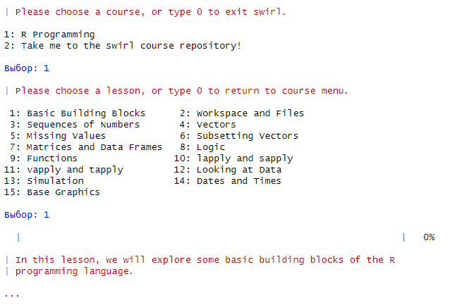

# Практика № 1

Введение в R

## Цель работы

1.  Разработать отчет с использованием стека технологий Rmarkdown и
    Quarto

2.  Оформить отчет в соответствии с шаблоном

3.  Познакомиться с языком R

4.  Пройти обучающие уроки в swirl

5.  Создать репозиторий на GitHub и запушить проект

## Исходные данные

1.  Ноутбук

2.  OC Windows

3.  Rstudio

4.  Библиотека swirl

5.  Github

## Общий план выполнения работы

1.  Установить пакет swirl

2.  Выполнить ознакомительные задания

3.  Создать репозиторий на GitHub

4.  Оформить отчёт

## Содержание практической работы

### Шаг 1

**На данном шаге происходит установка пакета swirl**

Для установки пакета swirl воспользуюсь функцией R
`install.packages("swirl")`

<figure>

<figcaption aria-hidden="true"><em>Установка пакета
swirl</em></figcaption>
</figure>

### Шаг 2

**На данном шаге происходит запуск заданий и их выполнение**

Для запуска swirl воспользуюсь функцией `swirl::swirl()`

После запуска необходимо пройти небольшую регистрацию и скачать
необходимый пакет курсов (в данном случае *R Programming: The basics of
programming in R*)

<figure>

<figcaption aria-hidden="true"><em>Регистрация и установка
пакета</em></figcaption>
</figure>

После скачивания пакета заданий, просиходит выбор необходимых заданий

<figure>

<figcaption aria-hidden="true"><em>Выбор первого
задания</em></figcaption>
</figure>

#### Первое задание (Basic Building Blocks)

По итогу прохождения данного задания я понял:

1.  Чтобы сохранить некоторое значения в переменную, необходимо
    воспользоваться специальным символом `<-`, например, `x <- 5 + 7`,
    данная запись обозначает, что в переменную с названием `x`,
    запишется результат выражения `5 + 7`

2.  Для просмотра додержимого той или иной переменной необходимо просто
    ввести ее наименование

3.  Так же можно присваивать переменным значения, которые получаются с
    использованием других переменных, например, `y <- x - 3`, где
    `x = 12`, поэтому в итоге в переменной `y` содержится значение 9

4.  В языке R существует основное понятие - вектор, любая переменная
    содержит вектор значений, даже переменная `x`, которая равна 12, это
    вектор, с длинной 1. Для создания вектора, можно воспользоваться
    функцией `c(...some_arg)`, например, присвою переменной `z` вектор
    значений `1.1, 9, 3.14`, то есть `z <- c(1.1, 9, 3.14)`, в итоге в
    переменной будет хранится вектор с длинной 3.

5.  Для того, чтобы узнать что делает та или иная функция, необходимо
    перед ней поставить знак `?`, например, `?c`

6.  Можно, так же, складывать вектора, например, имеется переменная z,
    которая содержит вектор 1.10 9.00 3.14, и необходимо создать новый
    вектор и добавить в него новое значение, допустим, 5, таким образом,
    чтобы это проделать необходимо прописать следующую команду `c(z, 5)`

7.  К векторам можно применять различные арифметические выражения (+ - /
    \* ^, `abs()`, `sqrt()` ), например, дан тот же вектор z и имеется
    выражение `z * 2`, по итогу получится новый вектор, каждое значение
    которого будет умножено на 2

8.  При использовании арфиметических выражений между двумя векторами
    стоит учитывать их длину, если два вектора имеют одинаковую длину,
    то происходит по-элементное выполнение той или иной операции,
    например, имеется вектор `z = (1, 2)` и `x = (3, 4)`, пусть данные
    векторы складываются `z + x`, по итогу получится вектор `(4, 6)`.
    Если вектора имеют разную длину, то происходит зацикливание
    наименьшего, например, имеется вектор `z = (1, 2, 3, 4)` и
    `x = (5, 6)` данные векторы складываются, по итогу получается вектор
    `(6, 8, 8, 10)`

``` r
5+7
```

    [1] 12

``` r
x <- 5+7
```

``` r
x
```

    [1] 12

``` r
y <- x - 3
```

``` r
y
```

    [1] 9

``` r
c(1.1, 9, 3.14)
```

    [1] 1.10 9.00 3.14

``` r
z <- c(1.1, 9, 3.14)
z
```

    [1] 1.10 9.00 3.14

``` r
?c
```

    запускаю httpd сервер помощи... готово

``` r
z
```

    [1] 1.10 9.00 3.14

``` r
c(z, 555)
```

    [1]   1.10   9.00   3.14 555.00

``` r
c(z, 555, z)
```

    [1]   1.10   9.00   3.14 555.00   1.10   9.00   3.14

``` r
z * 2 + 100
```

    [1] 102.20 118.00 106.28

``` r
my_sqrt <- sqrt(z-1)
```

``` r
3
```

    [1] 3

``` r
my_sqrt
```

    [1] 0.3162278 2.8284271 1.4628739

``` r
my_div <- z / my_sqrt
```

``` r
1
```

    [1] 1

``` r
my_div
```

    [1] 3.478505 3.181981 2.146460

``` r
c(1, 2, 3, 4) + c(0, 10)
```

    [1]  1 12  3 14

``` r
c(1, 2, 3, 4) + c(0, 10, 100)
```

    Warning in c(1, 2, 3, 4) + c(0, 10, 100): длина большего объекта не является
    произведением длины меньшего объекта

    [1]   1  12 103   4

``` r
(z * 2 + 1000)
```

    [1] 1002.20 1018.00 1006.28

``` r
my_div
```

    [1] 3.478505 3.181981 2.146460

#### Второе задание (Workspace and Files)

``` r
getwd()
```

    [1] "C:/Users/Kasperoid/Универ/ИАТПУИБ/Reports_IATPUIB/Pr1"

``` r
ls()
```

    [1] "my_div"  "my_sqrt" "x"       "y"       "z"      

``` r
x <- 9
```

``` r
ls()
```

    [1] "my_div"  "my_sqrt" "x"       "y"       "z"      

``` r
dir()
```

    [1] "images"                    "mytest2.R"                
    [3] "mytest3.R"                 "Pr1.markdown_strict_files"
    [5] "README.md"                 "README.qmd"               
    [7] "README.rmarkdown"          "testdir"                  
    [9] "testdir2"                 

``` r
?list.files
```

``` r
args(list.files)
```

    function (path = ".", pattern = NULL, all.files = FALSE, full.names = FALSE, 
        recursive = FALSE, ignore.case = FALSE, include.dirs = FALSE, 
        no.. = FALSE) 
    NULL

``` r
old.dir <- getwd()
```

``` r
dir.create("testdir")
```

    Warning in dir.create("testdir"): 'testdir' уже существует

``` r
setwd("testdir")
```

``` r
file.create("mytest.R")
```

    [1] TRUE

``` r
list.files()
```

     [1] "images"                    "mytest.R"                 
     [3] "mytest2.R"                 "mytest3.R"                
     [5] "Pr1.markdown_strict_files" "README.md"                
     [7] "README.qmd"                "README.rmarkdown"         
     [9] "testdir"                   "testdir2"                 

``` r
file.exists("mytest.R")
```

    [1] TRUE

``` r
file.info("mytest.R")
```

             size isdir mode               mtime               ctime
    mytest.R    0 FALSE  666 2024-10-18 20:12:02 2024-10-18 20:12:02
                           atime exe
    mytest.R 2024-10-18 20:12:02  no

``` r
file.rename("mytest.R", "mytest2.R")
```

    [1] TRUE

``` r
file.copy("mytest2.R","mytest3.R")
```

    [1] FALSE

``` r
file.path("mytest3.R")
```

    [1] "mytest3.R"

``` r
file.path("folder1", "folder2")
```

    [1] "folder1/folder2"

``` r
?dir.create
```

``` r
dir.create(file.path('testdir2', 'testdir3'), recursive = TRUE)
```

    Warning in dir.create(file.path("testdir2", "testdir3"), recursive = TRUE):
    'testdir2\testdir3' уже существует

``` r
setwd(old.dir)
```

По итогу прохождения данного задания я понял, что имеется набор команд,
которые позволяют создавать новые директории и файлы, просматривать пути
до них, копировать и переименовывать файлы

#### Третье задание (Sequences of Numbers)

``` r
1:20
```

     [1]  1  2  3  4  5  6  7  8  9 10 11 12 13 14 15 16 17 18 19 20

``` r
pi:10
```

    [1] 3.141593 4.141593 5.141593 6.141593 7.141593 8.141593 9.141593

``` r
15:1
```

     [1] 15 14 13 12 11 10  9  8  7  6  5  4  3  2  1

``` r
?":"
```

``` r
seq(1, 20)
```

     [1]  1  2  3  4  5  6  7  8  9 10 11 12 13 14 15 16 17 18 19 20

``` r
seq(0, 10, by=0.5)
```

     [1]  0.0  0.5  1.0  1.5  2.0  2.5  3.0  3.5  4.0  4.5  5.0  5.5  6.0  6.5  7.0
    [16]  7.5  8.0  8.5  9.0  9.5 10.0

``` r
my_seq <- seq(5, 10, length=30)
```

``` r
length(my_seq)
```

    [1] 30

``` r
1:length(my_seq)
```

     [1]  1  2  3  4  5  6  7  8  9 10 11 12 13 14 15 16 17 18 19 20 21 22 23 24 25
    [26] 26 27 28 29 30

``` r
seq(along.with = my_seq)
```

     [1]  1  2  3  4  5  6  7  8  9 10 11 12 13 14 15 16 17 18 19 20 21 22 23 24 25
    [26] 26 27 28 29 30

``` r
seq_along(my_seq)
```

     [1]  1  2  3  4  5  6  7  8  9 10 11 12 13 14 15 16 17 18 19 20 21 22 23 24 25
    [26] 26 27 28 29 30

``` r
rep(0, times = 40)
```

     [1] 0 0 0 0 0 0 0 0 0 0 0 0 0 0 0 0 0 0 0 0 0 0 0 0 0 0 0 0 0 0 0 0 0 0 0 0 0 0
    [39] 0 0

``` r
rep(c(0, 1, 2), times = 10)
```

     [1] 0 1 2 0 1 2 0 1 2 0 1 2 0 1 2 0 1 2 0 1 2 0 1 2 0 1 2 0 1 2

``` r
rep(c(0, 1, 2), each = 10)
```

     [1] 0 0 0 0 0 0 0 0 0 0 1 1 1 1 1 1 1 1 1 1 2 2 2 2 2 2 2 2 2 2

В результате прохождения данного урока я понял, что:

1.  Создание последовательности чисел с помощью `:`, можно создавать
    последовательности как из целочисленных значений (`1:20`, от 1 до
    20), так и из дробных (`pi:10`, от 3.14 до 9.14). Так же можно
    создавать последовательности чисел по убыванию, например `15:1`, в
    итоге получится последовательность от 15 до 1

2.  Помимо использования `:` при создании последовательности можно
    использовать функцию `seq(a, b, c)`, где a и b - начало и конец
    интервала соответственно, c - (by - шаг, length - длинна).

3.  Есть еще одна функция для создания последовательности чисел,
    `rep()`. Данная функция принимает символы и число повторений, то
    есть, например, `rep(0, times=40)` результатом будет строка из 40
    нулей. Так же из интересного можно повторять не только вектор или
    символ, но и каждый символ вектора, просто вместо второго аргумента
    можно передать `each = ...`, например, `rep(c(0, 1, 2), each=10)`,
    по итогу будет строка состоящая из подряд идущих 10 нулей, единиц и
    двоек

#### Четвертое задание (Vectors)

``` r
num_vect <- c(0.5, 55, -10, 6)
```

``` r
tf <- num_vect < 1
```

``` r
tf
```

    [1]  TRUE FALSE  TRUE FALSE

``` r
num_vect >= 6
```

    [1] FALSE  TRUE FALSE  TRUE

``` r
my_char <- c("My", "name", "is")
```

``` r
my_char
```

    [1] "My"   "name" "is"  

``` r
paste(my_char, collapse = " ")
```

    [1] "My name is"

``` r
my_name <- c(my_char, "Ivan")
```

``` r
my_name
```

    [1] "My"   "name" "is"   "Ivan"

``` r
paste(my_name, collapse = " ")
```

    [1] "My name is Ivan"

``` r
paste("Hello", "world!", sep = " ")
```

    [1] "Hello world!"

``` r
paste(1:3,c("X", "Y", "Z"),sep = "")
```

    [1] "1X" "2Y" "3Z"

``` r
paste(LETTERS, 1:4, sep = "-")
```

     [1] "A-1" "B-2" "C-3" "D-4" "E-1" "F-2" "G-3" "H-4" "I-1" "J-2" "K-3" "L-4"
    [13] "M-1" "N-2" "O-3" "P-4" "Q-1" "R-2" "S-3" "T-4" "U-1" "V-2" "W-3" "X-4"
    [25] "Y-1" "Z-2"

По итогу прохождения данного урока можно сделать следующие выводы:

1.  Векторы могут хранить разные значения, в том числе и логические
    (`TRUE`, `FALSE`). При использовании логических операторов
    (`> <= == !=`) с векторами происходит поэлементное применение того
    или иного логического выражения, по итогу получается вектор из
    булевых значений.

2.  Так же в языке R можно использовать логические ИЛИ (`|`), И (`&`).

3.  Из символьного вектора можно получить строку, используя команду
    `paste(вектор, collapse = разделитель|sep = разделитель)`.

#### Пятое задание (Missing Values)

``` r
x <- c(44, NA, 5, NA)
```

``` r
x * 3
```

    [1] 132  NA  15  NA

``` r
y <- rnorm(1000)
```

``` r
z <- rep(NA, 1000)
```

``` r
my_data <- sample(c(y, z), 100)
```

``` r
my_na <- is.na(my_data)
```

``` r
my_na
```

      [1] FALSE FALSE FALSE FALSE  TRUE FALSE  TRUE  TRUE FALSE FALSE  TRUE  TRUE
     [13] FALSE FALSE FALSE  TRUE FALSE FALSE  TRUE FALSE FALSE FALSE FALSE FALSE
     [25] FALSE  TRUE FALSE FALSE  TRUE  TRUE FALSE  TRUE FALSE  TRUE  TRUE FALSE
     [37] FALSE  TRUE FALSE FALSE  TRUE FALSE  TRUE FALSE FALSE FALSE  TRUE FALSE
     [49]  TRUE  TRUE FALSE  TRUE  TRUE  TRUE  TRUE  TRUE FALSE FALSE  TRUE  TRUE
     [61] FALSE  TRUE  TRUE FALSE  TRUE  TRUE  TRUE  TRUE  TRUE  TRUE FALSE  TRUE
     [73]  TRUE FALSE FALSE FALSE  TRUE FALSE FALSE  TRUE FALSE  TRUE  TRUE FALSE
     [85] FALSE  TRUE  TRUE FALSE FALSE  TRUE FALSE FALSE  TRUE FALSE  TRUE  TRUE
     [97] FALSE FALSE  TRUE  TRUE

``` r
my_data == NA
```

      [1] NA NA NA NA NA NA NA NA NA NA NA NA NA NA NA NA NA NA NA NA NA NA NA NA NA
     [26] NA NA NA NA NA NA NA NA NA NA NA NA NA NA NA NA NA NA NA NA NA NA NA NA NA
     [51] NA NA NA NA NA NA NA NA NA NA NA NA NA NA NA NA NA NA NA NA NA NA NA NA NA
     [76] NA NA NA NA NA NA NA NA NA NA NA NA NA NA NA NA NA NA NA NA NA NA NA NA NA

``` r
sum(my_na)
```

    [1] 48

``` r
my_data
```

      [1]  0.43945180 -1.61884465  0.90202829 -1.08202975          NA  1.69892745
      [7]          NA          NA -1.40400634  1.14829667          NA          NA
     [13] -0.39353014 -0.43686079  1.03396958          NA -1.55519063  0.68823836
     [19]          NA  0.87623900  0.41891230 -1.42878523 -0.39926201  1.84056275
     [25] -0.51255329          NA -0.54212249  0.07178514          NA          NA
     [31] -0.51293544          NA  0.39699660          NA          NA  0.01181908
     [37]  0.57901032          NA  0.56969307 -0.39997119          NA -0.21494456
     [43]          NA -2.23442873 -0.26201490  0.32904799          NA -1.99061497
     [49]          NA          NA -0.92270770          NA          NA          NA
     [55]          NA          NA  0.45073738  0.98885231          NA          NA
     [61]  0.15706431          NA          NA  0.23350042          NA          NA
     [67]          NA          NA          NA          NA  0.30386034          NA
     [73]          NA -1.13773053 -0.51707843  0.20810136          NA -0.27341719
     [79] -0.99509026          NA  0.80216650          NA          NA -0.55163943
     [85]  0.36619702          NA          NA  1.15569401  1.10846386          NA
     [91]  1.18996159  1.03851164          NA  0.74303859          NA          NA
     [97]  1.15139985 -1.51044362          NA          NA

``` r
0 / 0
```

    [1] NaN

``` r
Inf - Inf
```

    [1] NaN

1.  В R существует специальное значение: `NA` - пропущенное или
    некоторое содержимое, которое не имеет значения. К NA не применяются
    арифметические выражения.

2.  Функция `is.na()` показывает наличие NA в векторе (Но сравнить с NA
    нельзя, так как NA это неизвестное значение, то невозможно провести
    сравнение со значениями вектора)

3.  В R булевым значения приравниваются численные, то есть `True = 1`,
    `False = 0`

4.  Имеется еще ряд специальных значений: `NAN` - не число, получается
    путём деления 0 на 0 и `Inf`

## Оценка результатов

1.  Была подготовлена и настроена для работы среда RStudio

2.  Удалось познакомиться с методом составления отчета с помощью
    Rmarkdown

3.  Была произведена работа с языком R, знакомство с основами данного
    языка и особенностями

4.  Работа успешно загружена в репозиторий GitHub

## Вывод

По итогу данной работы были изучены основы языка R с помощью учебных
заданий swirl
