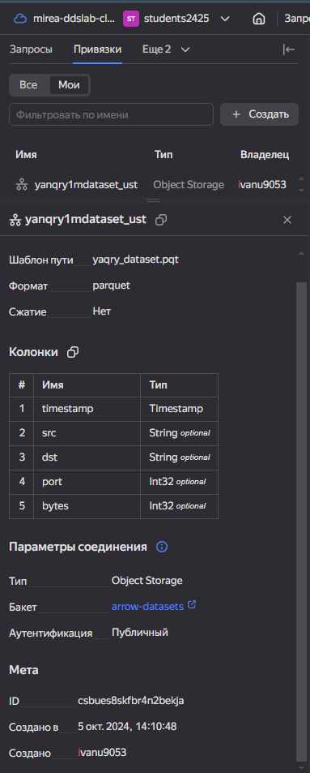
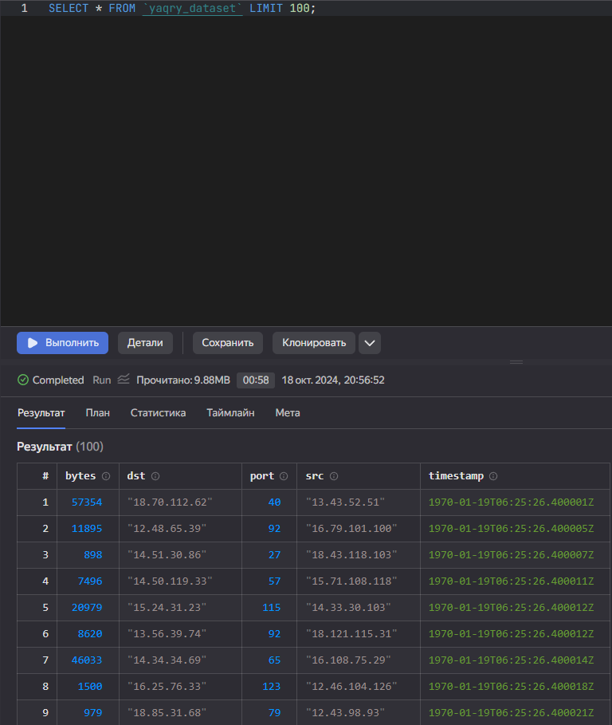
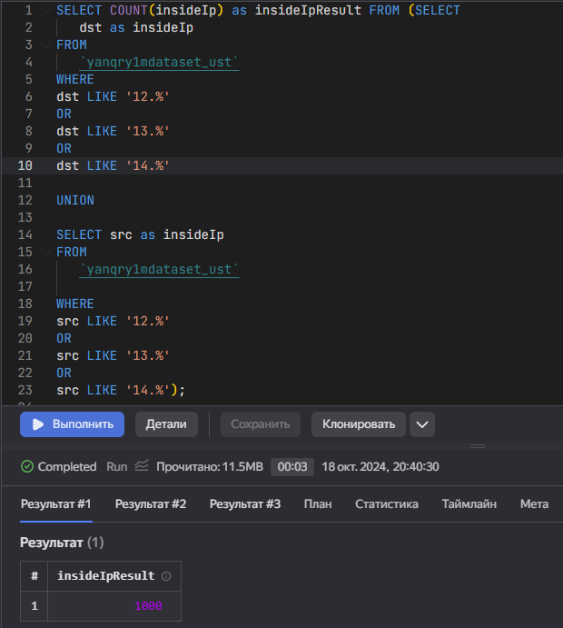
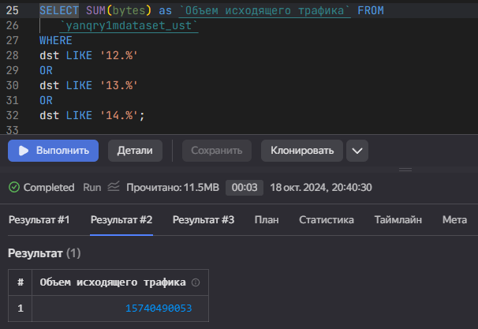
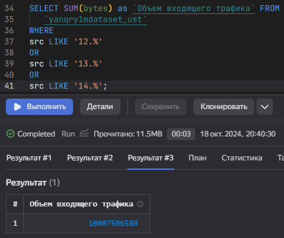

# Практическое задание 4

Использование технологии Yandex Query для анализа данных сетевой
активности

## Цель

1.  Изучить возможности технологии Yandex Query для анализа
    структурированных наборов данных
2.  Получить навыки построения аналитического пайплайна для анализа
    данных с помощью сервисов Yandex Cloud
3.  Закрепить практические навыки использования SQL для анализа данных
    сетевой активности в сегментированной корпоративной сети

## Исходные даннные

1.  Персональный компьютер

2.  Браузер

3.  R studio

4.  Yandex Cloud

5.  Yandex Query

## Общий план выполнения

1.  Проверить доступность данных в Yandex Object Storage
2.  Подключить бакет как источник данных для Yandex Query
3.  Выполнить задания

## Содержание ПР

### Шаг 1

**На данном шаге производится проверка доступности данных в Yandex
Object Storage**

Данные доступны

### Шаг 2

**На данном шаге производится подключение бакета как источника данных
для Yandex Query**

На рисунке ниже показана информация о созданной привязке



Далее производится отправка тестового запроса для проверки подключения.
Успех.



### Шаг 3

**На данном шаге происходит выполнение заданий**

1\. Определите количество хостов внутренней сети, представленных в
датасете



``` r
resultInsideIp <- 1000;
resultInsideIp
```

    [1] 1000

2\. Определите суммарный объем исходящего трафика



``` r
traficIshod <- 15740490053;
traficIshod
```

    [1] 15740490053

3\. Определите суммарный объем входящего трафика



``` r
traficVhod <- 10007506588;
traficVhod
```

    [1] 10007506588

## Оценка результатов

1.  Был проверен доступ данных в Yandex Object Storage, успешно
2.  Произведено подключение бакета как источника данных для Yandex Query
3.  Выполнены поставленные задания

## Вывод

Были изучены возможности технологии Yandex Query для анализа данных, так
же получены навыки построения аналитичесого пайплана и закреплены
практические навыки использования sql
