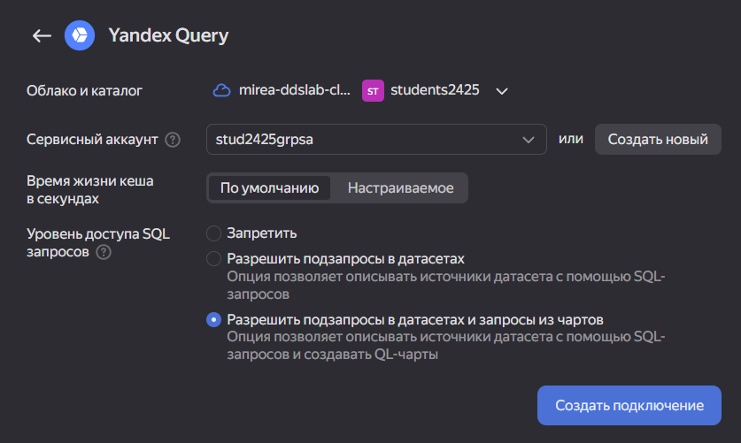
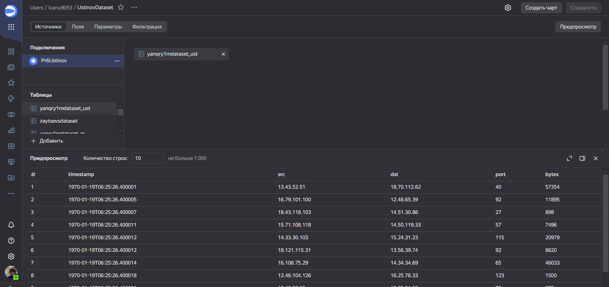
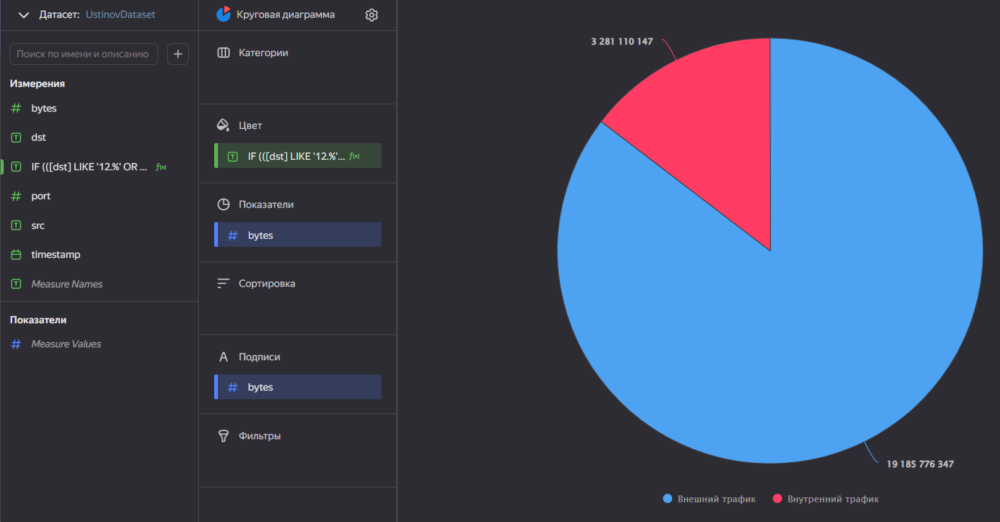
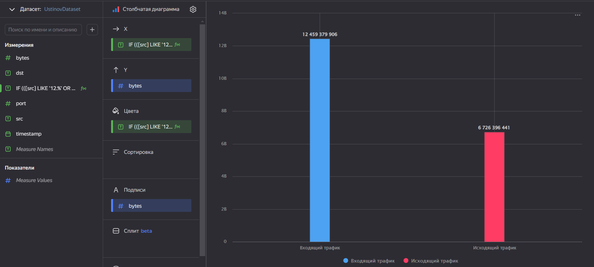
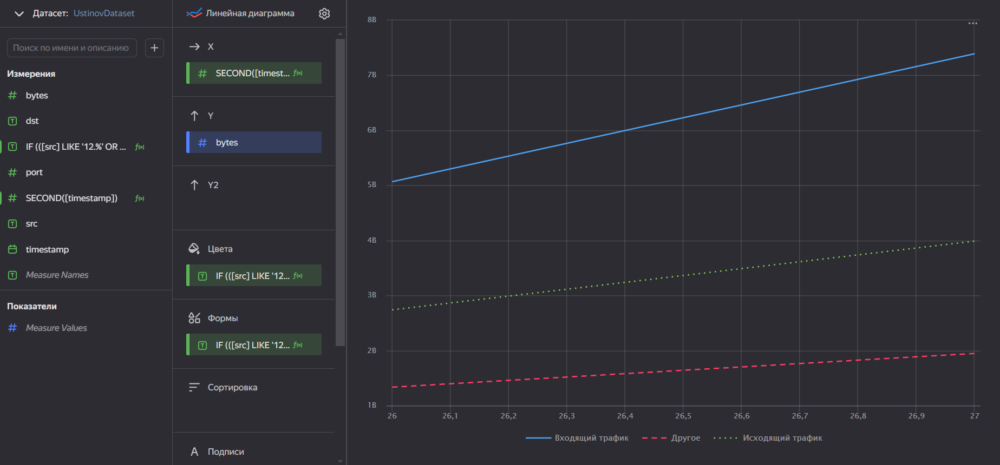
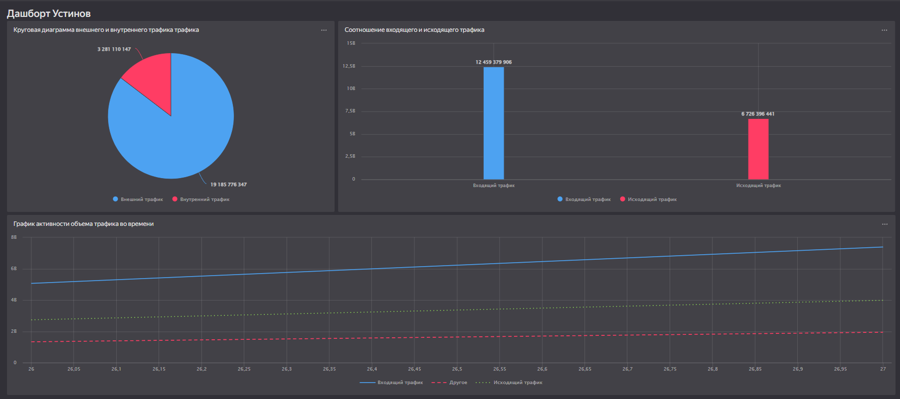

# Практическое задание 6

Использование технологии Yandex DataLens для анализа данных сетевой
активности

## Цель

1.  Изучить возможности технологии Yandex DataLens для визуального
    анализа структурированных наборов данных
2.  Получить навыки визуализации данных для последующего анализа с
    помощью сервиса Yandex Cloud
3.  Получить навыки создания решений мониторинга/SIEM на базе облачных
    продуктов и открытых программных решений
4.  Закрепить практические навыки использования SQL для анализа данных
    сетевой активности в сегментированной корпоративной сети

## Исходные даннные

1.  Персональный компьютер

2.  Браузер

3.  R studio

4.  Yandex DataLens

5.  Yandex Cloud

## Общий план выполнения

1.  Настроить подключение к Yandex Query из DataLens
2.  Создать из запроса YandexQuery датасет DataLens
3.  Выполнение заданий
4.  Подготовить отчёт

## Содержание ПР

### Шаг 1

**На данном этапе происходит настройка подключения к Yandex Query из
DataLens**



### Шаг 2

**На данном этапе происходит создание из запроса YandexQuery датасет
DataLens**



### Шаг 3

**На данном этапе происходит выполнение заданий**

#### Задание 1

Представить в виде круговой диаграммы соотношение внешнего и внутрннего
сетевого трафика



#### Задание 2

Представить в виде стообчатой диаграммы соотношение входящего и
исходящего трафика из внутреннего сетевого сегмента



#### Задание 3

Построить график активности (линейная диаграмма) объема трафика во
времени



#### Задание 4

Все построенные графики вывести в виде единого дашборда в Yandex
DataLens.



### Шаг 4

**На данном шаге производится подготовка отчёта**

``` r
print('Отчёт подготовлен')
```

    [1] "Отчёт подготовлен"

## Оценка результатов

Проведен анализ сетевой активности в сегментированной корпоративной сети

## Вывод

1.  Были изучены возможности технологии Yandex DataLens для визуального
    анализа структурированных наборов данных
2.  Получены навыки визуализации данных для последующего анализа с
    помощью сервиса Yandex Cloud
3.  Получены навыки создания решений мониторинга/SIEM на базе облачных
    продуктов и открытых программных решений
4.  Закреплены на практике навыки использования SQL для анализа данных
    сетевой активности в сегментированной корпоративной сети
